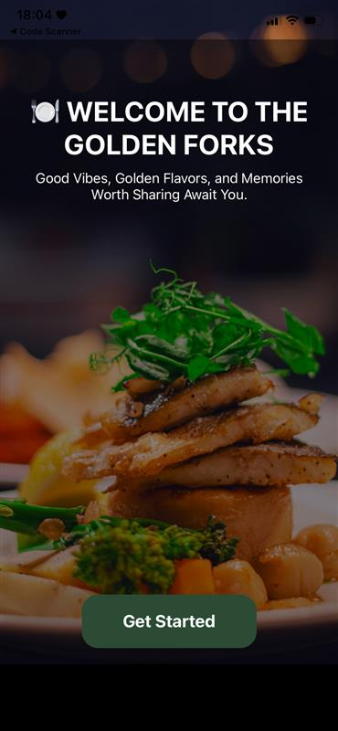
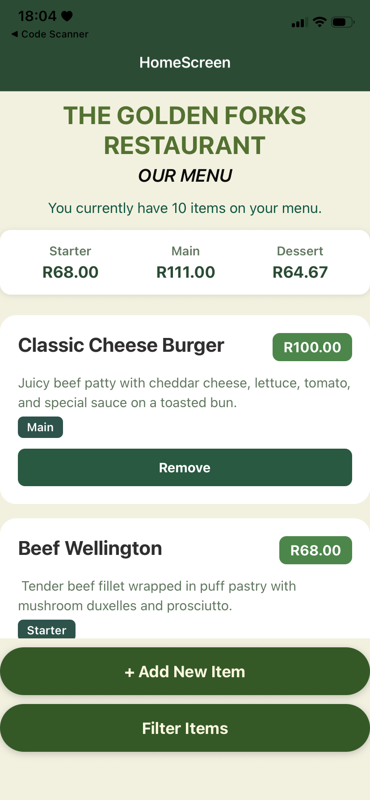
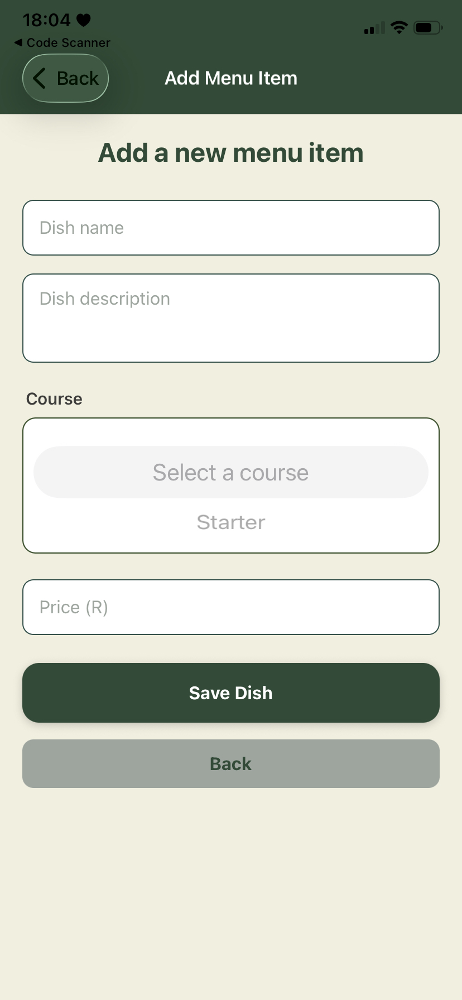
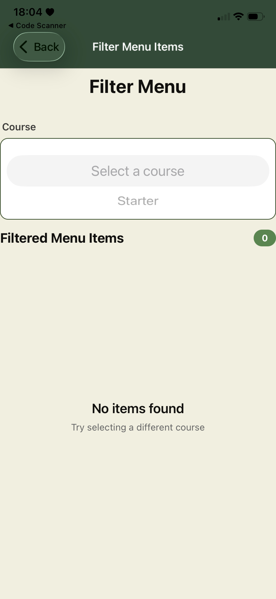

# 🍽️Golden Forks App

## A Restaurant Menu Management and Filtering Application

## POE Project Overview

**The Golden Forks App** is a mobile application developed for a restaurant that required a digital system to manage and display its menu more efficiently. The app allows the chef to add and remove menu items, while customers can view and filter dishes based on their preferred course starter, main course, or dessert.
The project was developed using TypeScript as part of the Module: MAST POE focusing on the app’s core functionality, navigation, and user interface.

## Technologies Used

• **TypeScript:** for structured and type-safe programming.

• **React Native:** for building cross-platform mobile applications.

• **Expo:**  for simplified testing and deployment.

• **React Navigation (Stack Navigator):** for seamless screen transitions.

## Features

• **Welcome Screen** with a “Get Started” button that directs users to the Home Screen.

• **Home Screen** displaying predefined menu items with clear layout and easy navigation.

• **Add Menu Item Screen** allowing the chef to add new dishes with details such as name, description, course, price.

• Input Validation using TypeScript to ensure correct and complete data entry.

• Responsive UI/UX Design with consistent spacing, color scheme, and improved readability.

• Smooth Navigation between all screens using Stack Navigator.

## App Navigation Flow

1. **Welcome Screen →** Displays the app’s title and navigation button.
    
     

2. **Home Screen →** Displays menu items and allows adding new ones.

    

3. **Add Menu Item Screen →** Used by the chef to add dishes and save them to the menu.

     

4. **Filter Screen→** Displays newly added dishes immediately and filtered courses.

    

**Personal Reflection**

During this phase, I strengthened my technical knowledge of React Native, TypeScript, and screen navigation. I learned to implement interactive features, manage state effectively, and validate user input to prevent errors.
I also improved the visual design and usability of the app, focusing on layout alignment, readability, and consistent color themes. This part of the project helped me understand how to combine both coding logic and interface design to create a user-friendly mobile application.

## Changelog

• Enlarged and repositioned the button on the Welcome Screen to the bottom for a more balanced layout.

• Moved the heading and subheading to the top of the Welcome Screen to improve visual hierarchy.

• Added two new functional screens the Home Screen and Add Menu Item Screen for better interaction.

• Redesigned the Home Screen layout to include cards displaying dish name, course, and price clearly.

• Added predefined menu items to display sample dishes when the app first loads.

• Implemented the Add Menu Item Screen to allow chefs to add new dishes with name, description, course type, and price.

• Introduced an intensity selector (Mild, Balanced, Strong) when adding new items to enhance detail.

• Integrated Stack Navigator and Navigation Container in app.tsx for smooth navigation between screens.

• Updated type definitions in type.tsx and renamed ManageScreen to AddItemScreen for code clarity.

• Implemented TypeScript-based input validation to prevent empty or invalid form submissions.

• Updated configuration files (package.json, package-lock.json, and tsconfig.json) to include necessary dependencies.

• Improved the UI/UX design with new shades of green, better contrast, and cleaner text formatting.

• Enhanced font sizing, color contrast, and spacing for better accessibility and readability.

• Improved app responsiveness and performance, ensuring smooth operation across different devices.

## References
• React Native Documentation. (2024). Components and APIs. Meta Platforms. Available at: https://reactnative.dev/docs/components-and-apis

• TypeScript Handbook. (2024). TypeScript for JavaScript Developers. Microsoft. Available at: https://www.typescriptlang.org/docs/

• Expo Documentation. (2024). Using Expo for React Native Development. Available at: https://docs.expo.dev/

• W3Schools. (2024). CSS and Design Guidelines. Available at: https://www.w3schools.com/css/

• FreeCodeCamp. (2024). React Native Navigation and App Structure. Available at: https://www.freecodecamp.org/news/tag/react-native/
